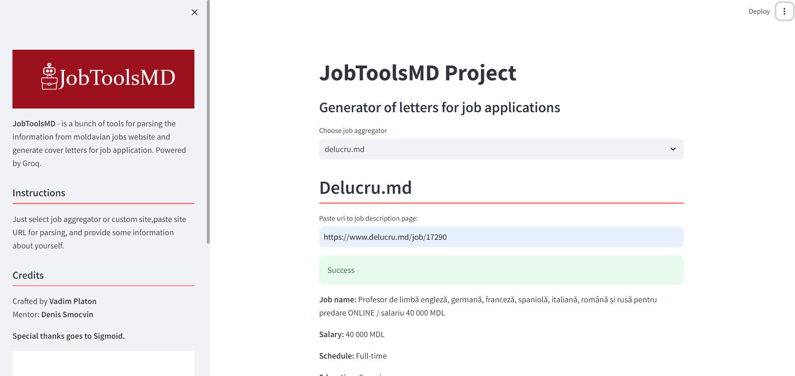

 # CoverAI
 
 ## About The Project

JobToolsMD - is a bunch of tools for parsing the information from moldavian jobs website and generate cover letters for job application. Powered by Groq.

 ### Built With

- [Python](https://www.python.org/)
- [Streamlit](https://streamlit.io/)
- [Groq](https://groq.com/)

 ### Screenshots
 
 ## Getting Started

To get a local copy up and running follow these simple example steps.
 ### Prerequisites

This project was written using Python 3.12.

 ### Installation

1. Get a free API Key at [https://console.groq.com/docs/quickstart](https://console.groq.com/docs/quickstart)
2. Clone the repo
   ```sh
   git clone https://github.com/platonvadim/JobToolsMD.git
   ```
3. Install python packages
   ```sh
   pip install -r requirements.txt
   ```
4. Create env variable with your API. Example for Windows:
    ```sh
    $Env:GROQ_API_KEY = '<API>'
    ```
    Example for Linux:
    ```sh
    export GROQ_API_KEY=<API>
    ```
 ## Usage

```sh
    streamlit run main.py
```

 ## Roadmap

- [x] Add delucru.md possibility
- [x] Add rabota.md parsing possibility
- [x] Job suitability checker
- [ ] Rewrite on Django
- [ ] Copy to clipboard and save to file features
- [ ] Local database of all jobs
- [ ] Multi-language support
  - [ ] Russian
  - [ ] Romanian

 ## Contributing


If you have a suggestion that would make this better, please fork the repo and create a pull request. You can also simply open an issue with the tag "enhancement".
Don't forget to give the project a star! Thanks again!

1. Fork the Project
2. Create your Feature Branch (`git checkout -b feature/AmazingFeature`)
3. Commit your Changes (`git commit -m 'Add some AmazingFeature'`)
4. Push to the Branch (`git push origin feature/AmazingFeature`)
5. Open a Pull Request
 ## License

Distributed under the MIT License. See [MIT License](https://opensource.org/licenses/MIT) for more information.
 ## Contact

Vadim Platon - [@twitter](https://x.com/mr_vadim_platon)

Project Link: [https://github.com/platonvadim/JobToolsMD](https://github.com/platonvadim/JobToolsMD)

